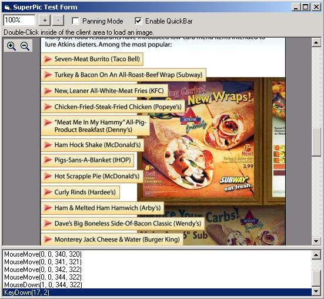



## SuperPicture \(Updated\) \- A More Powerful PictureBox Control

### Description

SuperPicture is a modified PictureBox that supports scrolling and zooming. (Updated to include Panning support and fixes outstanding bugs. Added Picture property.) Based on original code submission by "amirnezhad", entitled "Simple Scrollable Image Viewer". Now is available as a UserControl. QuickBar for integrated zooming. Fixed scrollbar coloration. Well documented. I appreciate any feedback and/or votes. Enjoy!
 
### More Info
 

             |
---                |---
**Submitted On**   |2004-02-06 09:05:08
**By**             |[Joseph M\. Ferris](https://github.com/Planet-Source-Code/PSCIndex/blob/master/ByAuthor/joseph-m-ferris.md)
**Level**          |Intermediate
**User Rating**    |5.0 (45 globes from 9 users)
**Compatibility**  |VB 5\.0, VB 6\.0
**Category**       |[Custom Controls/ Forms/  Menus](https://github.com/Planet-Source-Code/PSCIndex/blob/master/ByCategory/custom-controls-forms-menus__1-4.md)
**World**          |[Visual Basic](https://github.com/Planet-Source-Code/PSCIndex/blob/master/ByWorld/visual-basic.md)
**Archive File**   |[SuperPictu170489262004\.zip](https://github.com/Planet-Source-Code/joseph-m-ferris-superpicture-updated-a-more-powerful-picturebox-control__1-51493/archive/master.zip)

